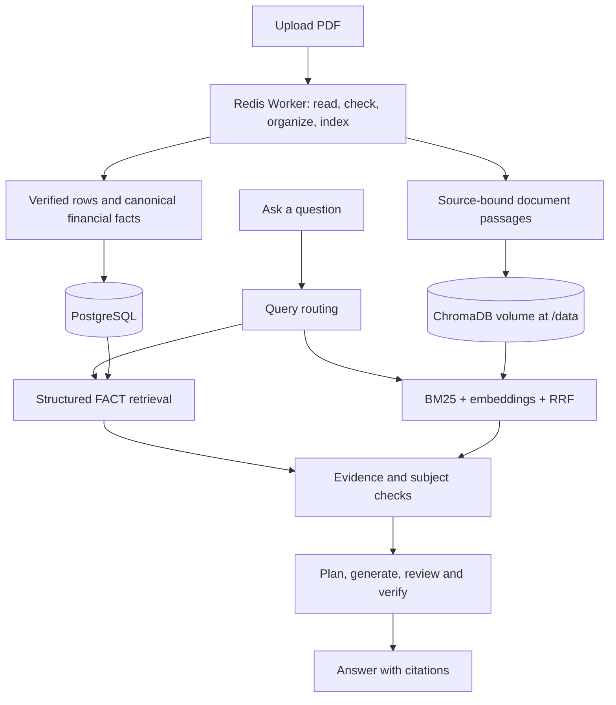

# Financial Research Assistant

**English** | [简体中文](README_CN.md)

**Read financial reports. Find the numbers. Check the source.**

Upload a report, ask a question, and follow the answer back to the original page. Financial Research Assistant combines structured financial data with document search, so figures and explanations keep their context.

## What you can do

| Task | What it does |
| --- | --- |
| Upload reports | Save PDFs and follow processing progress. |
| Find financial data | Retrieve supported metrics with their year, unit and reporting scope. |
| Ask questions | Get evidence-grounded explanations from your reports. |
| Check sources | Follow citations to the supporting passages and PDF pages. |
| Search documents | Find relevant passages without generating an answer. |
| Choose an AI service | Configure an approved local or external model. |

Uploading a file does not make it ready for questions. Formal reports must complete all five processing checks first. Search match scores are not answer-accuracy scores.

## Why it exists

Financial-report research has a few recurring traps:

- **The right number, the wrong context.** Table columns, periods, units and consolidated versus parent-company figures must stay attached to the data.
- **The right report, the wrong company.** A controlling shareholder's business is not automatically the listed company's business. Subject-attribution checks preserve this distinction.
- **An answer without a trail.** Claims need supporting evidence, not just similar text. Document identity, pages and citations remain traceable.
- **An upload that stops halfway.** Persisted task state, recovery and idempotent dispatch make processing observable and recoverable.

These are system safeguards, not a promise that every report or question can be answered.

## How it works

Built with React, Python/FastAPI, PostgreSQL, Redis workers and ChromaDB.



**Structured FACT path:** financial rows map conservatively to canonical metrics. Facts retain entity, period, scope, value, currency, unit and provenance. Structural verification is separate from semantic mapping; ambiguous labels remain unmapped. Cash-and-bank balances are not silently treated as cash and cash equivalents.

**Hybrid search:** BM25 keyword search and embeddings are combined with reciprocal rank fusion (RRF). Retrieved passages still need source and subject checks before supporting an answer.

**Reliable processing:** parsing, quality checks, fact building, tree-artifact building and indexing retain stage state, leases and recovery. Dispatch obligations close when tasks become terminal; duplicate deliveries are handled idempotently.

**AI-service boundary:** provider, model and endpoint are configurable. Missing token-usage data does not turn a valid generation into a failure. Validated answers can be sent in segments over SSE; this is not native model-token streaming.

Tree artifacts and experimental retrieval components exist in the source. V1 does not claim universal Tree-retrieval quality.

## Start with Docker

For a **fresh installation**:

```bash
git clone https://github.com/csl1234213/financial-research-assistant.git
cd financial-research-assistant
cp .env.example .env
# Set unique, strong authentication, PostgreSQL and Redis secrets in .env.
docker compose config --quiet
docker compose up -d --build
```

On PowerShell, use `Copy-Item .env.example .env`. Once services are healthy, open [localhost:3000](http://localhost:3000), sign in, upload a report and wait for processing to finish.

Before starting:

- Keep populated environment files and API keys private. Never commit them.
- Review ports, named volumes and user/workspace access. A shared workspace is not a private per-account document library.
- External model calls are disabled by default: `ALLOW_REAL_PROVIDER=false`. Enabling them can send report content to the configured service and incur charges.
- Backend migration startup and Worker migration policy are defined in [Compose](docker-compose.yml). Existing databases need verified backups and a reviewed migration plan.

> [!WARNING]
> These commands are not an in-place production upgrade. Preserve the entire active Chroma persistence directory before replacing a legacy container. Mounting an empty volume at `/data` is not a migration. Do not reuse production volumes or run destructive cleanup without an approved plan.

## V1 delivery checks

The validated application base is `ce0b9c64890c81519be7e06df46847adc2043bd7`. Application/PostgreSQL alignment, migration to Alembic head `20261002_10`, controlled ingestion Canary and Chroma persistent-volume migration were accepted.

Chroma persistence was verified by **removing and replacing the container**, reusing its named volume at `/data`, and recovering all **3,675 records and vectors** with matching metadata, document and vector digests. Source access, Hybrid retrieval and subject-attribution checks were replayed after replacement.

See [release acceptance results](docs/releases/public-release-acceptance.md) for test scope and skipped checks. Subject-attribution acceptance used deterministic generation/review over real persisted evidence; it is not a new live-model quality benchmark.

## Know the limits

Report coverage varies by layout, issuer, language, notes and accounting convention. Unsupported or ambiguous evidence must not be presented as verified data. Check important figures against the original report.

JWT authentication and user/workspace checks apply to documents, facts, vectors and tasks. Review workspace policy for your intended deployment. Local models require separate hardware, latency and capability qualification.

Short-term production observation passed. **No long-term SLA, availability percentage, long-term stability or unsupported accuracy metric is claimed.**

This public repository has clean history. It contains no production backups, private operator configuration or credentials. Publication sanitization rejects a retired JWT value by its SHA256 digest without publishing the original literal.

## Development checks

```bash
cd frontend
npm ci
npm test
npm run build
```

Backend release checks cover security, dispatch recovery, ingestion, attribution, grounded answers and deployment contracts. Install dependencies in an isolated environment and run the documented test scope, Ruff and Compose validation. Real-provider calls require separate authorization.

- [External full-report fixture setup](docs/releases/external-fixture.md)
- [V1 release notes](docs/releases/v1.0.0.md)
- [Public-source security boundary](docs/releases/public-source-boundary.md)
