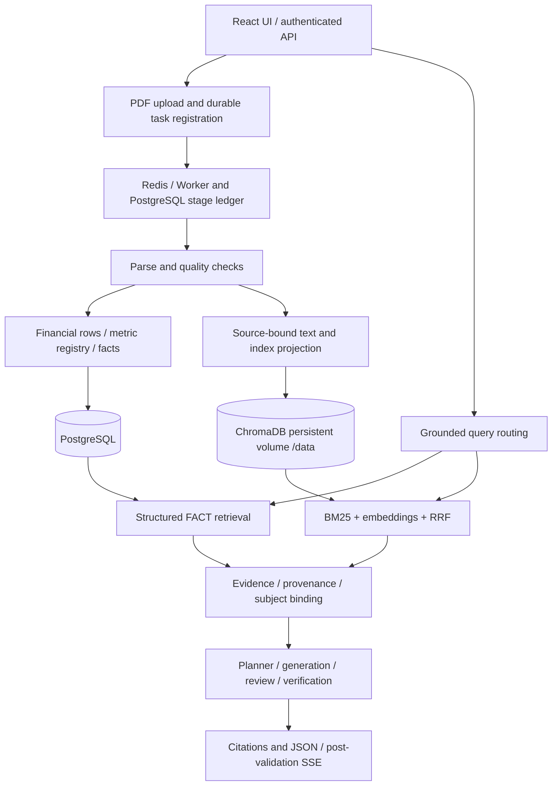

# Financial Research Assistant

**English** | [简体中文](README_CN.md)

Financial RAG V1 is an evidence-grounded financial-document research system built with Python/FastAPI, React, PostgreSQL, Redis workers and ChromaDB. It supports PDF ingestion, structured financial questions and cited narrative research.

## What it addresses

Financial reports are more than text chunks. A number can be misread when its period, unit, reporting scope or table column is lost. A relevant passage can describe a controlling shareholder rather than the listed issuer. This project preserves those relationships and rejects unsupported claims instead of treating retrieval similarity as proof.

- **Structured FACT retrieval:** reconstructed statement rows are mapped conservatively to canonical metrics. Facts retain entity, period, scope, value, currency, unit and source provenance. Structural verification and semantic mapping remain separate.
- **Hybrid retrieval:** BM25 and embeddings are fused with reciprocal rank fusion (RRF), with source-bound evidence handed to the grounded answer path.
- **Evidence and citations:** document identity, page and evidence references accompany claims. Original-source PDF access remains subject to ownership checks.
- **Subject attribution guard:** issuer evidence and controlling-shareholder/group evidence are distinguished. A group passage cannot silently support an issuer claim.
- **Durable ingestion:** parsing, quality checking, fact building, tree-artifact building and indexing use persisted stage state, leases and recovery. Dispatch obligations close when tasks become terminal; duplicate delivery is handled idempotently.
- **Provider boundary:** local or external providers are configurable. Generation success is separate from optional token usage. Provider access is opt-in; capability and timeout limitations are explicit.
- **Grounded SSE delivery:** validated answers can be delivered in response segments. This is not native model-token streaming.

## Architecture

Tree artifacts and experimental retrieval components exist in the source, but this release does not claim universal Tree-retrieval quality or universal PDF coverage.

## V1 delivery evidence

The validated application base is `ce0b9c64890c81519be7e06df46847adc2043bd7`. Production application/PostgreSQL alignment, migration to Alembic head `20261002_10`, controlled ingestion Canary, and Chroma persistent-volume migration were accepted.

Chroma persistence was verified by **removing and replacing the new container**, mounting the same named volume at `/data`, and recovering all **3,675 records and vectors** with metadata/document/vector digest equality. Original-source access, Hybrid retrieval and subject attribution checks were replayed after replacement. This is not merely a same-container restart test.

> [!IMPORTANT]
> Short-term production observation passed. No long-term SLA, availability percentage, long-term production stability or general accuracy improvement is claimed. Subject-attribution acceptance included deterministic generation/review over real persisted evidence; it is not a new live-model quality benchmark.

This public repository starts with clean history. Publication sanitization replaces one retired JWT literal with an equivalent SHA256 rejection check; it does not change the production deployment or erase the old repository's history. No credentials, production snapshots or private operator configuration are distributed.

## Docker deployment

Use [docker-compose.yml](docker-compose.yml) for a **fresh installation**, not an automatic in-place production migration.

1. Copy `.env.example` to your private `.env` and supply unique, strong authentication, PostgreSQL and Redis secrets. Never commit the populated file.
2. Review ports, explicitly named volumes and workspace/access configuration. Do not reuse existing production volume names without an approved migration plan.
3. Run `docker compose config --quiet`, then `docker compose up -d --build`.
4. Check readiness and Worker health before allowing uploads. Chroma's persistent volume must mount at `/data`.

Backend migration startup and Worker migration policy are defined in Compose. For an existing database, take a verified backup, review the migration lineage and use a controlled maintenance/canary procedure rather than blindly upgrading.

External model calls are disabled by default (`ALLOW_REAL_PROVIDER=false`). Configure approved provider credentials privately and enable calls explicitly when needed. The accepted production deployment used privately bound operator overlays; these files and their secret values are intentionally not shipped.

> [!WARNING]
> Preserve the entire active Chroma persistence directory before replacing a legacy container whose `/data` is in its writable layer. Mounting an empty volume over `/data` is not a migration. Do not run destructive volume cleanup commands as part of an upgrade.

## Access and validation boundaries

Users are authenticated with JWT; formal documents, facts, vectors and tasks are checked against user/workspace identity. Accounts sharing a workspace do not automatically imply a private per-account knowledge base. Deployment account/workspace policy must be reviewed for the intended use.

Standard-statement normalization has real-report regressions, but coverage varies by issuer, layout, notes, language and accounting convention. Ambiguous metrics remain unmapped. Chinese cash-and-bank balances are not silently equated with cash and cash equivalents.

## Development checks

Install the project's dependencies in an isolated environment. Release checks include JWT/security tests, dispatch recovery, formal ingestion, subject attribution, grounded narrative delivery, deployment contracts, Ruff and Compose validation. Real-provider tests require separate authorization and are not needed for offline release checks.

See [external full-report acceptance setup](docs/releases/external-fixture.md), [V1 release notes](docs/releases/v1.0.0.md) and [public-source security boundary](docs/releases/public-source-boundary.md).
