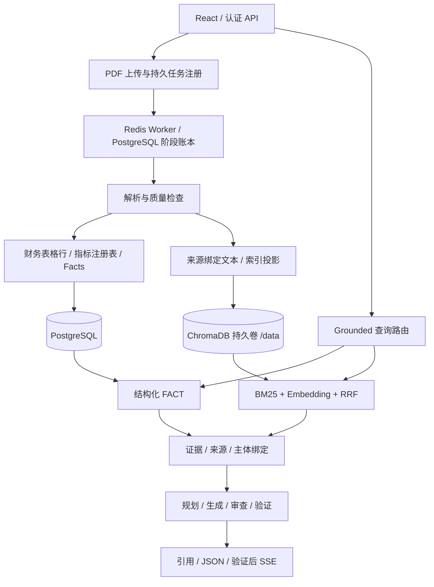

# Financial Research Assistant

[English](README.md) | **简体中文**

Financial RAG V1 是基于证据的财报研究系统，采用 Python/FastAPI、React、PostgreSQL、Redis Worker 和 ChromaDB，支持 PDF 入库、结构化财务指标查询与带引用的文字分析。

## 解决什么问题

财报不能只按普通文本切块。数字可能因期间、单位、报表范围或表格列关系丢失而被误读；相关段落也可能描述控股股东，而不是上市公司。本项目保留这些关系，并拒绝无证据支撑的结论，不把相似度当作事实证明。

- **结构化 FACT 查询：** 财务报表行经过保守指标映射，事实保留主体、期间、范围、金额、币种、单位及来源。表格结构验证与指标语义验证分开处理。
- **Hybrid 检索：** BM25 与向量检索通过 RRF 融合，向回答层交付绑定来源的证据。
- **证据与引用：** 结论关联文档、页码和证据；原 PDF 的访问继续执行用户及工作空间权限检查。
- **主体归因保护：** 区分上市公司和控股股东／集团。集团业务段落不能被静默归入上市公司业务。
- **可靠异步入库：** 解析、质量检查、事实构建、Tree artifact 构建、索引五阶段保留状态、租约和恢复记录；任务终态关闭 dispatch obligation，重复投递按幂等边界处理。
- **Provider 边界：** 本地与外部模型可配置；生成成功与可缺失的 token usage 分离。调用权限、能力和超时限制显式设置。
- **Grounded SSE：** 已验证答案支持分段发送；这不是模型原生 token streaming。

## 架构

源码包含 Tree artifact 及实验检索组件，但不宣称所有 Tree 查询均已达到生产质量，也不宣称所有 PDF 都能完整解析。

## V1 交付状态

已验收应用基线为 `ce0b9c64890c81519be7e06df46847adc2043bd7`。生产应用与 PostgreSQL 对齐、迁移至 Alembic `20261002_10`、受控入库 Canary 及 Chroma 持久卷迁移均已通过。

Chroma 持久化通过**删除并替换新容器**验证：全新容器挂载同一 named volume 到 `/data`，恢复全部 **3,675 条记录及向量**，metadata、正文和向量摘要一致；替换后重新检查了原 PDF、Hybrid 检索与主体归因。这不是仅重启原容器的测试。

> [!IMPORTANT]
> 短时生产观察已通过，但不承诺长期 SLA、可用率百分比、长期稳定性或普遍准确率提升。主体归因验收包含真实持久证据上的确定性生成／审查回放，不等于新增真实模型质量基准。

公开仓库使用干净历史。公开净化将一项退役 JWT 字面值改为等价 SHA256 拒绝校验，不改动现有生产部署，也不清除旧仓库历史。公开内容不携带密钥、生产快照或私密运维配置。

## Docker 部署

[docker-compose.yml](docker-compose.yml) 用于**全新安装**，不是自动升级现有生产系统的脚本。

1. 将 `.env.example` 复制为私密 `.env`，设置独立、足够强的认证、PostgreSQL 和 Redis 密钥；不要提交填入真实值的文件。
2. 检查端口、显式 volume 名称及工作空间权限策略。未经迁移方案确认，不要复用现有生产卷。
3. 执行 `docker compose config --quiet`，再执行 `docker compose up -d --build`。
4. 检查 readiness 与 Worker 健康状态后再开放上传；Chroma 的持久化卷必须挂载到 `/data`。

Compose 定义了 Backend 启动迁移及 Worker 迁移策略。已有数据库升级必须先验证备份、确认 migration lineage，并采用维护窗口和受控 Canary，不能直接盲目升级。

外部模型调用默认关闭：`ALLOW_REAL_PROVIDER=false`。需要时，在私密配置中设置获准的 Provider 凭据并显式启用。生产验收使用了私密绑定的运维 overlays，这些文件及密钥不会公开。

> [!WARNING]
> 旧容器的有效 `/data` 若位于 writable layer，替换前必须保存整个持久化目录。把空卷覆盖挂载到 `/data` 不等于迁移；升级不要附带破坏性 volume 清理。

## 权限与验证边界

JWT 标识用户；正式文档、Facts、向量与任务检查用户／工作空间归属。同一工作空间内的账号共享材料，不意味着默认提供每账号私有知识库。部署时需要确认账号与工作空间政策。

标准报表归一化有真实财报回归，但覆盖率仍受公司、布局、附注、语言和会计口径影响。不确定指标保留为未映射；不会把“货币资金”直接折叠为“现金及现金等价物”。

## 开发检查

使用独立环境安装依赖。发布验证覆盖 JWT/security、dispatch 恢复、正式 ingestion、主体归因、grounded 回答、部署配置、Ruff 和 Compose。真实 Provider 测试需要独立授权，不作为离线公开发布检查的必要条件。

参见 [外部完整财报验收配置](docs/releases/external-fixture.md)、[V1 发布说明](docs/releases/v1.0.0.md) 与 [公开源码安全边界](docs/releases/public-source-boundary.md)。
