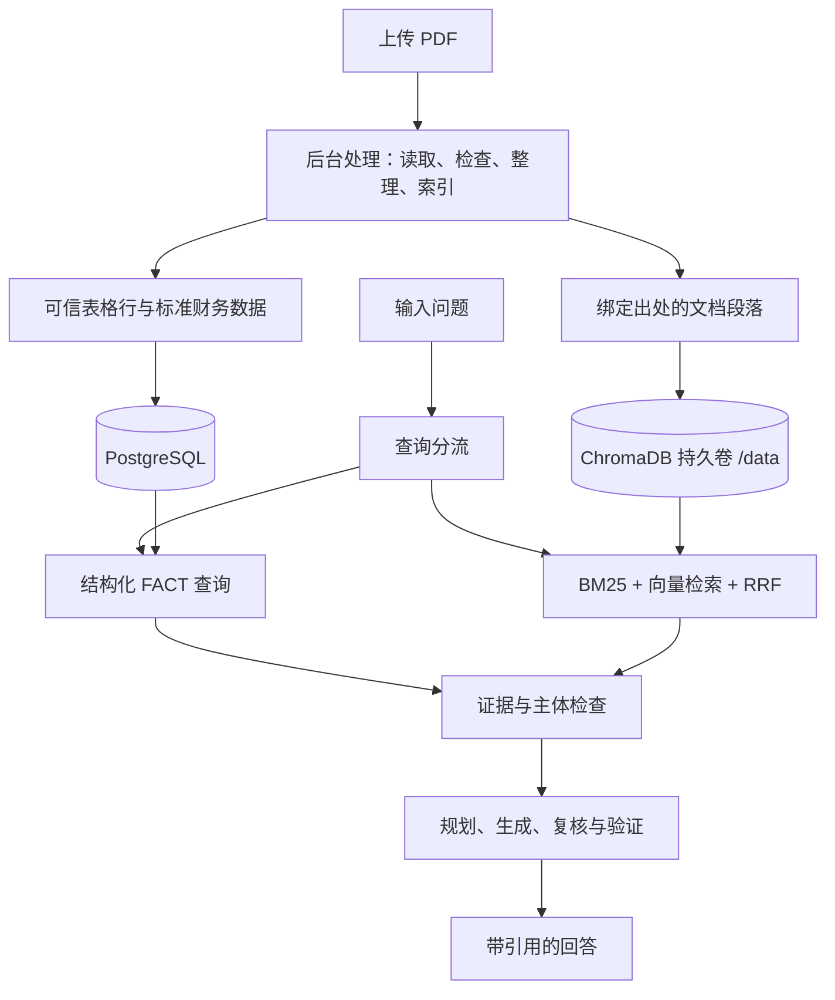

# 财报工作台

[English](README.md) | **简体中文**

**读懂财报，找到数据，核对出处。**

上传财报，直接提问，再沿着引用查看原文。财报工作台把财务数据查询与文档搜索放在一起，让数字、解释和出处保持关联。

## 可以做什么

| 功能 | 用途 |
| --- | --- |
| 上传财报 | 保存 PDF，查看处理进度。 |
| 查询数据 | 查找支持的指标、年份和口径。 |
| 财报问答 | 根据财报证据回答问题。 |
| 查看出处 | 查看引用原文与 PDF 页码。 |
| 内容搜索 | 查找相关段落，不生成回答。 |
| AI 服务 | 配置获准使用的本地或外部模型。 |

上传完成不等于可以提问。正式财报须完成全部五项处理检查。搜索匹配度也不等于回答准确率。

## 解决什么问题

读财报时，常见的难点不只是“找不到一段文字”：

- **数字找对，口径读错。** 表格列、年份、单位、合并报表与母公司报表必须与数字一起保留。
- **报告找对，主体认错。** 控股股东的业务不等于上市公司的业务。主体归因检查保留这一区别。
- **答案有了，出处没了。** 结论需要证据支持，不能只凭文字相似。文档身份、页码和引用可追溯。
- **文件传完，处理中断。** 持久化任务状态、恢复机制和幂等派发，让处理过程可查看、可恢复。

这些是系统保护机制，不代表所有财报与问题都能回答。

## 如何工作

使用 React、Python/FastAPI、PostgreSQL、Redis Worker 与 ChromaDB。



**结构化数据：** 财务表格行保守映射到标准指标，保留主体、期间、口径、数值、币种、单位和出处。表格结构可信与指标语义可信分开判断；无法确定的指标不强行映射。“货币资金”不会被直接等同于“现金及现金等价物”。

**混合搜索：** BM25 关键词检索与向量检索通过 RRF 合并。搜到段落之后，仍须检查出处和主体，才能支持回答。

**可靠处理：** 解析、质量检查、财务数据整理、树结构构建与索引保留阶段状态、租约和恢复记录。任务进入终态后关闭派发义务，重复投递按幂等方式处理。

**模型边界：** 服务、模型与地址可以配置。缺少 token 用量不意味着生成失败。通过验证的回答可经 SSE 分段发送；这不是模型原生逐 token 输出。

源码保留树结构与实验性检索组件。V1 不承诺树检索在所有问题上的质量。

## 开始使用

以下步骤适用于**全新安装**：

```bash
git clone https://github.com/csl1234213/financial-research-assistant.git
cd financial-research-assistant
cp .env.example .env
# 在 .env 中设置独立、强随机的认证、PostgreSQL 和 Redis 密钥。
docker compose config --quiet
docker compose up -d --build
```

PowerShell 使用 `Copy-Item .env.example .env`。服务健康后打开 [localhost:3000](http://localhost:3000)，登录、上传财报，等待处理完成后提问。

启动前请注意：

- 填写后的环境文件和服务密钥须保密，不要提交到 Git。
- 检查端口、命名卷和用户工作区权限。共享工作区不等于每个账号都有私有文档库。
- 默认禁用外部模型调用：`ALLOW_REAL_PROVIDER=false`。开启后可能向所配置的服务发送财报内容，并产生费用。
- 后端启动迁移与 Worker 迁移策略见 [Compose](docker-compose.yml)。已有数据库须先验证备份，并审查迁移方案。

> [!WARNING]
> 上述命令不是生产环境原地升级方案。替换旧 Chroma 容器前，须保存完整的有效持久化目录。将空卷挂到 `/data` 不等于完成迁移。未经批准，不要复用生产卷或执行破坏性清理。

## 交付验证

已验证的应用基线为 `ce0b9c64890c81519be7e06df46847adc2043bd7`。应用与 PostgreSQL 对齐、迁移至 Alembic head `20261002_10`、受控入库 Canary，以及 Chroma 持久卷迁移已通过验收。

Chroma 验证包含**删除并替换容器**，重新挂载同一命名卷至 `/data`，恢复全部 **3,675 条记录与向量**，并核对元数据、文档与向量摘要一致。替换后重新验证了原文访问、混合检索与主体归因。

测试范围与跳过项见 [公开发布验收记录](docs/releases/public-release-acceptance.md)。主体归因验收使用真实持久化证据与确定性生成、复核，不是新增的真实模型质量基准。

## 使用边界

解析覆盖随版式、公司、语言、附注和会计口径变化。缺少支持或存在歧义的证据，不能当作已验证数据展示。重要数字请核对财报原文。

文档、财务数据、向量和任务使用 JWT 认证及用户工作区检查。部署时请审查工作区权限。本地模型还需单独验收硬件、延迟与能力。

短期生产观察已通过。**不承诺长期 SLA、可用率、长期稳定性或未经支持的准确率。**

公开仓库采用干净历史，不包含生产备份、私有运维配置或凭据。发布清理通过 SHA256 摘要拒绝已停用的 JWT 值，不公开原始值。

## 开发检查

```bash
cd frontend
npm ci
npm test
npm run build
```

后端发布检查覆盖安全、派发恢复、入库、主体归因、带证据回答与部署合约。请在隔离环境安装依赖，按记录运行测试、Ruff 和 Compose 验证。真实模型调用须单独授权。

- [完整财报测试文件配置](docs/releases/external-fixture.md)
- [V1 发布说明](docs/releases/v1.0.0.md)
- [公开源码安全边界](docs/releases/public-source-boundary.md)
